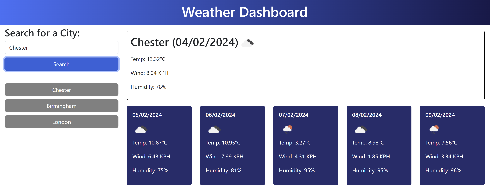

# Weather dashboard
## Description
The Weather Dashboard application allows users to search for weather information based on city names. It provides current weather details and a 5-day forecast. The application utilizes API from OpenWeatherMap to get the weather data.
## Usage
In the search input field, enter the name of the city you would like to check the weather for.

Click the search button.

The weather forecast will appear.

Click on the previous searches displayed under the search button for quick access.

## Link to deployed application
https://sonia-robin.github.io/weather-dashboard/
## Credits
N/A
## License
N/A
